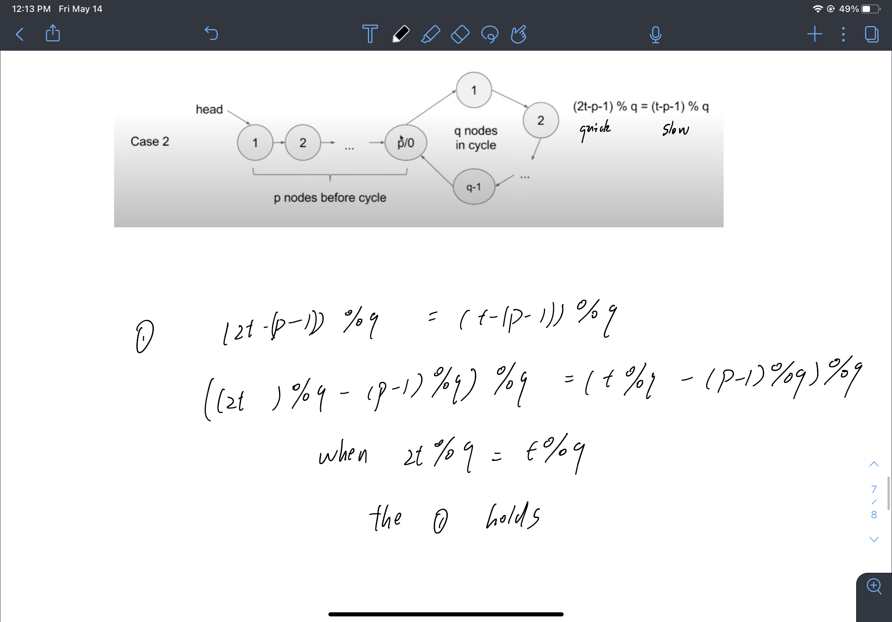

# LinkedList

* 如何定义

```cpp
struct ListNode {
    int val;
    ListNode *next;
    ListNode() : val(0), next(nullptr) {}
    ListNode(int x) : val(x), next(nullptr) {}
    ListNode(int x, ListNode *next) : val(x), next(next) {}
};
```

* 小技巧
    * 在dealing with edge case的时候，最好定义一个dummy node，使得dummy的下一个指向当前的head，以防止要把head删掉时候自己没有办法trace的情况
    * 在比较任意node之前，谨记需要进行null pointer的防守

* 总体思路
    * 循环
        * 从前到后
            * 先将当前node的事情处理完，再去处理下一个node
            * 比较复杂，需要考虑诸多edge case
    * 递归
        * 从后到前
            * 先将最后的node处理完之后再去处理前一个node，效果跟postorder一样
            * 代码简洁，但是有额外Space Complexity
            * 经典题目
                * 翻转链表

                ```cpp
                ListNode* reverseList(ListNode* head) {
                    if(head == NULL || head->next == NULL) return head;
                    
                    ListNode* after_part = reverseList(head->next); // since after_part's head node is actuall the end node, we cannot directly modify it
                    head->next->next = head;                        // instead, we actually have memory of the end node of after_part's, that's the next node of our cur node
                    head->next = NULL;                              // we only reverse the cur node
                    return after_part;                              // still return the after_part, but this time, after_part has grown longer
                }
                ```

* 双指针
    * 快慢指针 (19)
        * 隔着固定距离 = 一个指针先走固定距离，下个指针再跟上就是固定距离了
        * 正好到中点   = 一个快指针永远比慢指针走快两倍，这样快指针到终点的时候，慢指针刚到中点
        * 经典题目
            * 判断Linkedlist是否有环(141)，设置两个快慢指针，一个一次走两步，一个一次走一步，如若他们俩最后在一个地方交接了，说明就是有环的
            
            * 上图t为慢指针走过的步数，根据证明我们可以知道只要走过的步数是环长的倍数，那么一定两个指针会交接
            * Follow up (142)
                * 我们根据上面证明还可以知道环是从上面时候开始的
                * 因为 $t = q$, 所以其实两个pointe根据上述算法r在圈里meet up的位置是 $q - p$ 的位置, 所以我们想知道 $p$ 多长，只需要把一个指针再放到开头，让两个指针再次以同样步调前进，这样他们第一次meet up的地方就一定是环开始的地方
            * 判断两个链表汇合的位置 (160), 需要多去想一下每个list的size关系